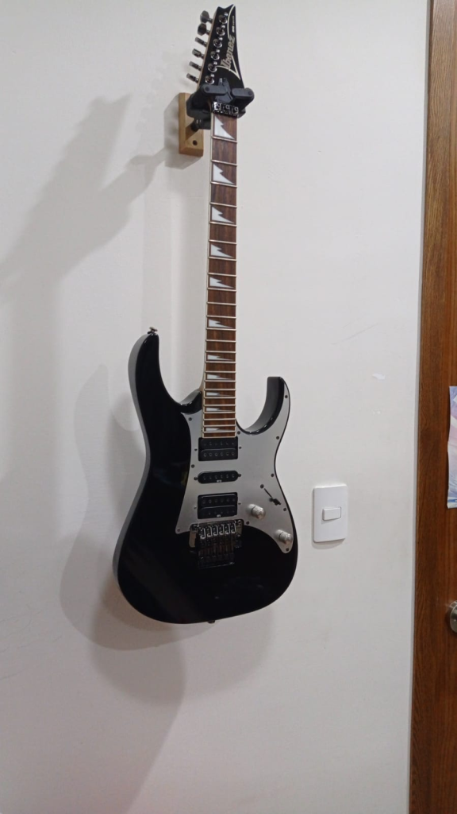
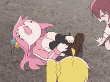
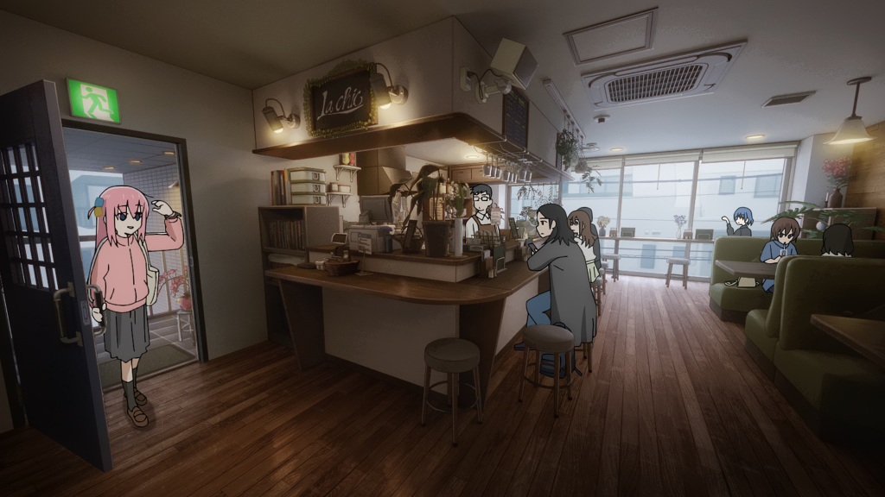
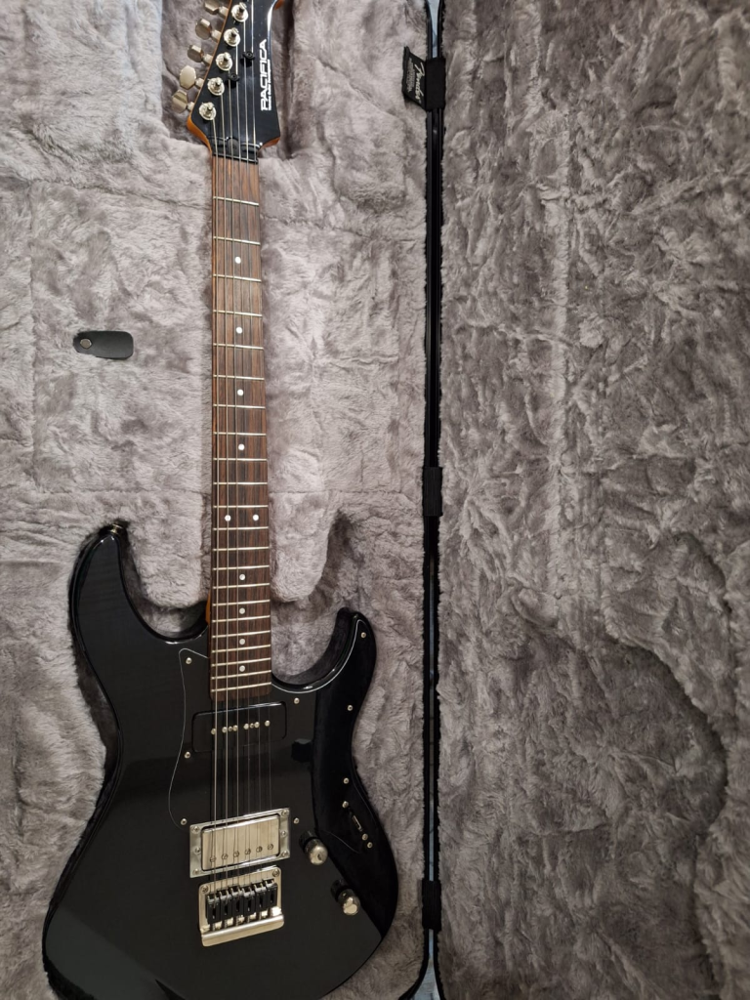
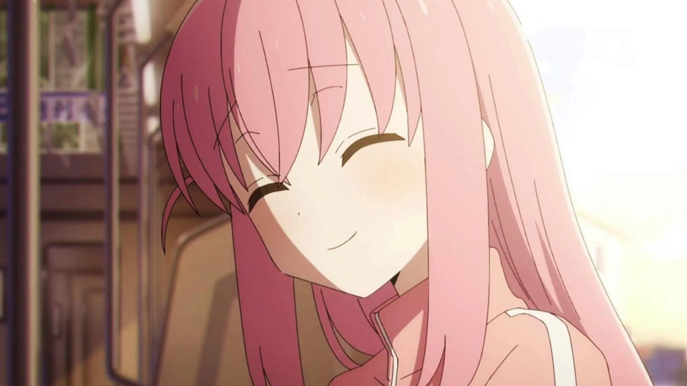
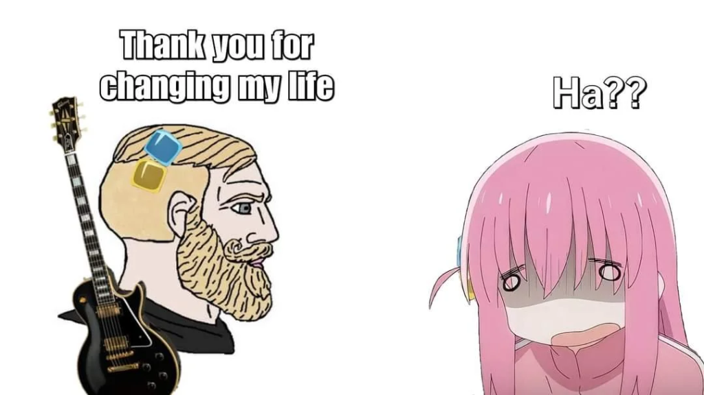

This is one of those weird posts I will do once in a while.

When I was 8 years old, I started watching internet videos, and for some reason, I found a guy who made guitar arrangement for video game music. This channel was gone for a while, but it seems that lonlonjp‘s music is up again.

That was the moment I fell in love with the guitar. After asking my mother a few times, she bought me a guitar and hired a tutor my aunt knew to teach me the instrument. He mainly played flamenco and had majored in music at my local university, so he taught me those styles until I was good enough to continue on my own.

I attended a Catholic school (this is quite common in my country), and what does a loner who barely talks to people do to pass the time? Exactly! I joined the church choir as a guitarist. This gave me a perfect excuse to skip some classes and seclude myself from other human beings during lunch breaks to practice.

Anyhow, when I was 14, I discovered a series with cute anime girls called K-ON!, and oh boy, did it impact me. I wanted to play the electric guitar so badly. For my birthday, I asked my mom for an electric guitar, and eventually, it became a reality. It was an Ibanez RG350EXZ that I named Lucy. For some reason, I have this custom of naming all of my guitars. Here is a picture of her.

During secondary school (or whatever it is called), I wanted so badly to form a band that played K-ON! music and perform in front of my school, but I never had the courage or the friends to do it. So, it never happened.

In high school, I tried again to form a band. I even had a friend who started playing the guitar, and I taught him a little during lunch breaks. However, we had very different tastes, and nothing came of it. I remember secluding myself from other people again during long lunch breaks to spend the time practicing.

During this time, I took summer courses in music production because I dreamed of being a producer. However, I fell in love with physics and decided to choose that as my major in university.

When university came, I stopped playing. Music was no longer my focus because I majored in physics, I needed to concentrate solely on that (what a mistake). Four years passed with me almost never picking up my guitar to practice. During my last semester, a new series aired called Bocchi the Rock! It had a cute, pink-haired anime girl on the cover, and as a fellow expert in pink-haired anime girls, I decided to give it a try.

SHE WAS JUST LIKE ME FR FR!!

This show simply slapped me in the face with reality in a way I didn’t think was possible. Here’s a common situation for me: I don’t like being in new places without people who know the area because I feel like everyone is watching a guy who is out of place. So… I never enter those places!

The scene below reminded me of that.

This show left a lasting impression. The music was simply amazing. The guitar performances in all the songs seemed so fun to play that I had to give it a try. So, I picked up my guitar and started playing again. I haven’t felt this way since the K-ON! days.

Bocchi the Rock! made me fall in love with music all over again. The show ended with Bocchi buying a new guitar. After searching for it, I found a Yamaha supplier in my city who could import the Pacifica 611 that Bocchi buys at the end of the season. My model isn’t the exact one, as the supplier informed me that it is no longer in production or for sale. However, I found a variant of the model, and with some light modifications, I created my Bocchi guitar, which I named Bocchi, of course.

Apart from music, this series also led to new friendships. At a meeting with a professor, I met a guy who had Bocchi’s merch on his backpack, and after a few awkward conversations, we became really good friends. We recently went to the cinema to see the recap movies, we had a great time, and the people never stopped laughing.

Reflecting on my journey, I realize how impactful Bocchi the Rock! has been in my life. This series reignited my passion for music and reminded me of the joy that comes from playing the guitar. After years of setting it aside, I found myself immersed in the music once again, rediscovering the excitement and satisfaction that comes with each strum.

I am now trying to finish my master degree, I have more friends, but still no band. I guess I was not Bocchi enough.

